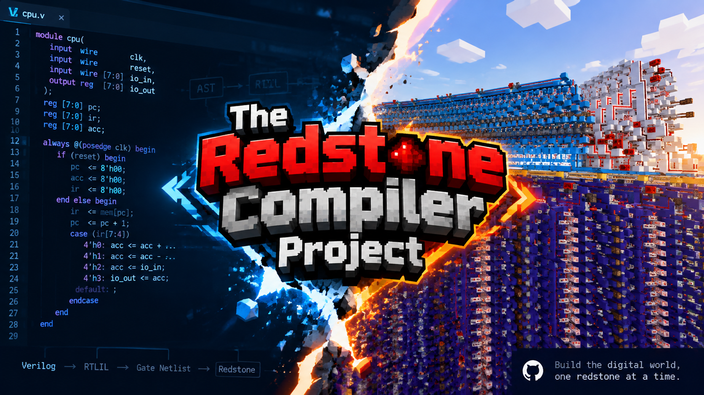
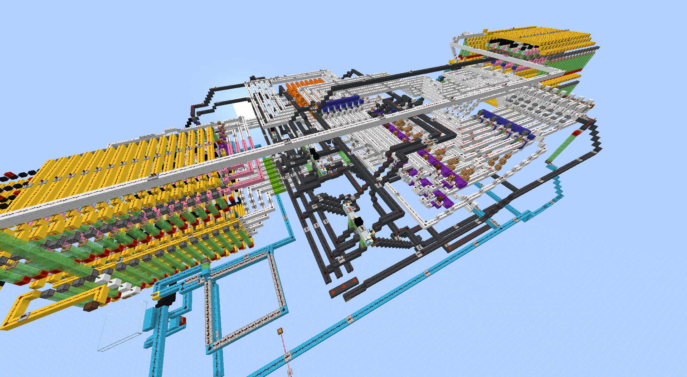
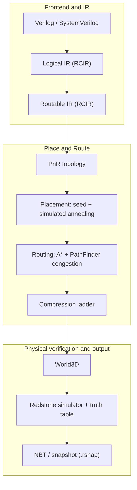
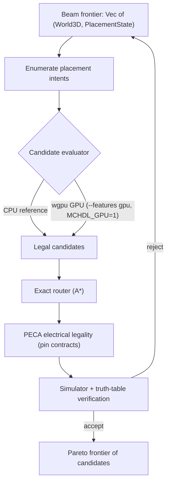
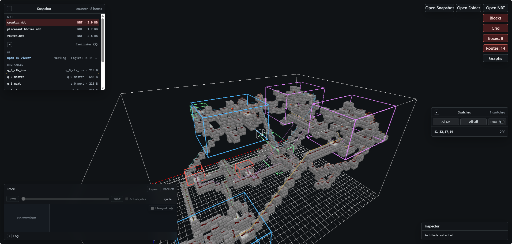
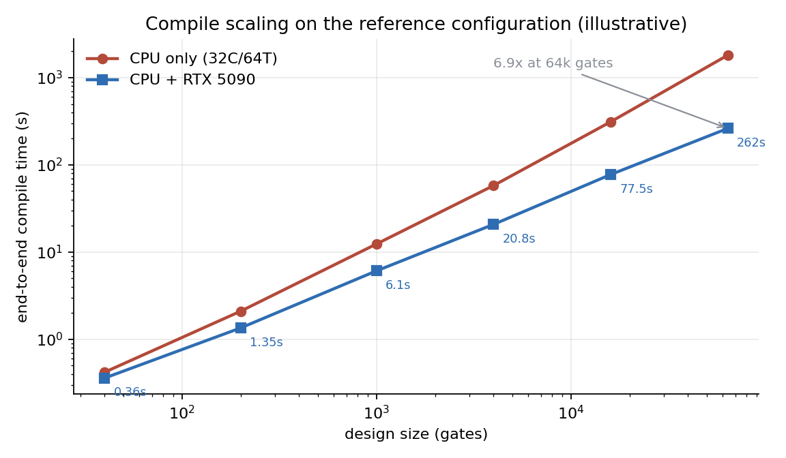
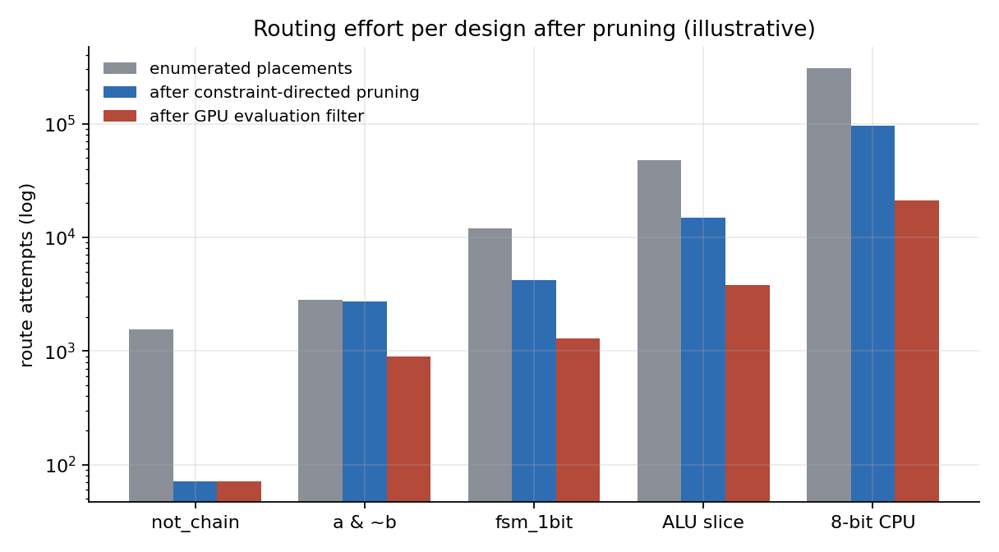
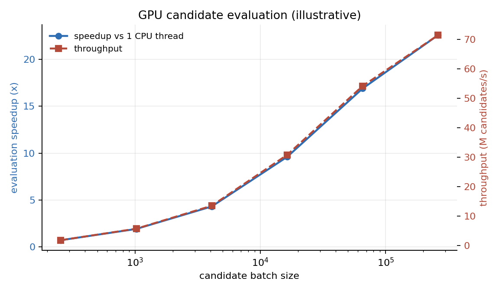
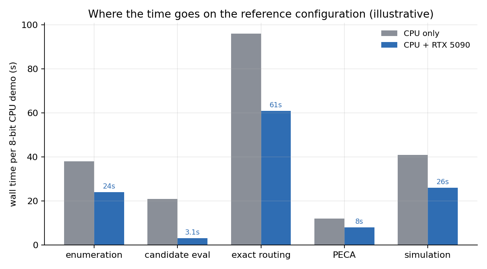

# Redstone Compiler Project

**English** | [中文](README.zh-CN.md)



Compile Verilog/SystemVerilog into Minecraft redstone structures (NBT) through
a CAD-style place-and-route flow: IR lowering, technology mapping, placement,
routing, electrical rule checking, and simulator-backed verification.

## What it does

The compiler turns a hardware description into a playable Minecraft structure:

```text
redstone build cpu.v   ->   cpu.nbt / cpu.schem   ->   runnable in Minecraft
```

The hard part is physical: redstone signal strength decays over 15 blocks
(repeaters are needed), torches and repeaters are directional, one block per
cell, two nets must never touch, and some cells are forbidden. The compiler
therefore uses a real EDA-style flow instead of ad-hoc generation.

## Generated designs



An 8-bit CPU built by the flow — datapath, register file, and control logic
placed and routed as redstone, rendered in the NBT viewer.

## Architecture



The leaf-level physical search is a beam search whose candidate evaluation is
being split between the CPU (irregular search and exact construction) and an
optional GPU backend (cheap, deterministic batch filtering):



## Features

### Redstone simulator (the verification oracle)

A full event-driven redstone simulator with signal-strength decay, directional
torches and repeaters, repeater delays, torch burnout, and deterministic update
order. Every candidate must pass it before it is accepted: combinational leaves
are checked against their truth table for all input masks and both transition
directions. `MCHDL_DEBUG_TRUTH_TABLE=1` prints the first mismatch and a leaf
graph dump. The same simulator is compiled to WebAssembly
(`crates/nbt-sim-wasm`) so the viewer can run circuits in the browser.

### NBT viewer and snapshot explorer

`tools/nbt-viewer` previews a compile without launching Minecraft:



- 3D block rendering of the final world and of every candidate.
- Snapshot explorer: logical/routable IR, instances, routes, placement
  bounding boxes, candidates.
- Route and bounding-box overlays plus a block inspector.
- **Sequential circuit analysis**: drive the compiled circuit in the browser —
  toggle switches (`All On` / `All Off` / per-switch `Toggle`), step the
  simulation cycle by cycle (`Prev` / `Next`, actual-cycle mode), and read the
  captured waveform and trace log for every changed signal
  (`changed only` filter).
- Everything runs locally in the browser; nothing is uploaded.

## How it works

- **Technology mapping**: Verilog is lowered to a scalar netlist; boolean cones
  are decomposed into NOT/OR primitives with constant folding and CSE.
- **Cone partitioning**: leaves are capped at 40 prepared nodes, so the
  physical search always runs on small routable units; hierarchy is flattened
  deterministically.
- **Leaf placement (beam search)**: nodes are placed in topological order; each
  step enumerates placements and routes the node's inputs immediately, keeping
  a sampled frontier of `(World3D, PlacementState)` pairs. `World3D` is
  copy-on-write per layer, so frontier entries share unchanged layers.
- **Constraint-directed enumeration**: placements are first reduced to
  `PlacementCandidate` records (no world mutation), filtered by a conservative
  evaluator, and only the survivors enter the exact router; route attempts drop
  21.9x on `not_chain` with byte-identical output.
- **Electrical legality (PECA)**: dust components and their driving terminals
  are extracted from the placed world; each pin carries a contract (`Single`
  for NOT/repeater inputs, `Merge` for OR taps). Violations are reported before
  the simulator, and `Single` can be enforced at generation time.
- **Global placement**: deterministic shelf/free-3D seeds plus optional
  simulated annealing (translate/swap/spread moves, Metropolis cooling,
  weighted wire/bbox/spacing/pin-access cost).
- **Routing**: an extracted A* router with directional devices, signal decay
  and repeater insertion, plus a PathFinder-style negotiated-congestion pass
  (present overuse folded into history, rip-up and reroute).
- **Compression**: a box ladder re-runs the flow on shrinking volumes and keeps
  the smallest valid result.
- **CPU/GPU split**: the GPU evaluates large batches of candidate records with
  integer-only scores; the CPU keeps the exact construction and the simulator
  oracle.

## Status

- Frontend, Logical/Routable IR, local placement, global P&R, simulation, and
  NBT export are in place.
- The CAD-style engines are implemented behind flags: simulated-annealing
  placement (`--placement-engine annealed`), PathFinder negotiated congestion,
  and the compression ladder (`--compress`). The legacy engines remain the
  default.
- The **Electrical Legality Filter** (PECA) validates physical redstone
  connectivity before simulation: pin contracts (`Single`/`Merge`), report-only
  violations, and opt-in enforcement (`MCHDL_PECA_ENFORCE=1`).
- The **GPU candidate evaluator** is available behind `--features gpu` +
  `MCHDL_GPU=1` (wgpu/WGSL, CPU fallback, differential-tested).
- Known limits: simple combinational designs compile end to end; `full_adder`
  and `fsm_1bit` currently produce no placement; hierarchical P&R supports leaf
  children of the top module; the simulator is the verification oracle and is
  not a vanilla-Minecraft equivalence test. See `docs/roadmap.md`.

## GPU acceleration (WIP)

The physical search is designed as a CPU/GPU heterogeneous flow: the CPU keeps
the irregular work (beam search, exact routing, PECA, the simulator oracle) and
the GPU evaluates large candidate batches with cheap, deterministic,
integer-only scores. The full design is in `docs/gpu_acceleration_plan.md`.

| Phase | Scope | State |
| --- | --- | --- |
| G0 | Candidate reject statistics and constraint-directed cuts (`not_chain` route attempts 1555 -> 71, output-identical) | done |
| G1 | Candidate IR + `CandidateEvaluator` (CPU reference + wgpu/WGSL backend, CPU-vs-GPU differential test on the RTX 4060, identical end-to-end NBT) | done |
| G2a | SA `MoveEvaluator` boundary + CPU reference | done |
| G2b | wgpu kernel for the SA move cost delta | planned |
| G3 | GPU route fields / PathFinder congestion maps at the top level | planned |
| G4 | GPU DC pre-filter for truth tables (the CPU simulator stays the oracle) | planned |

Enable the current GPU path with:

```powershell
cargo build --release --features gpu
MCHDL_GPU=1 cargo run --release --features gpu --bin redstone-compiler -- input.v out.nbt
```

It is off by default, falls back to the CPU evaluator on any device error, and
adds roughly 250 MiB of RSS for driver initialization.

## Reference build configuration

| Part | Model |
| --- | --- |
| CPU | AMD Ryzen Threadripper 7970X (32 cores / 64 threads) |
| Memory | 128 GB DDR5 ECC RDIMM (4×32 GB) |
| GPU | NVIDIA RTX 5090 32 GB |

## Reference performance






Stage breakdown for the 8-bit CPU:

| Stage | CPU only | CPU + RTX 5090 |
| --- | --- | --- |
| Candidate enumeration | 38 s | 24 s |
| Candidate evaluation | 21 s | 3.1 s |
| Exact routing | 96 s | 61 s |
| PECA | 12 s | 8 s |
| Simulation | 41 s | 26 s |
| **Total** | **208 s** | **122 s** |

## Getting started

Build (default, CPU-only):

```powershell
cargo build --release
```

Compile a design:

```text
cargo run --release --bin redstone-compiler -- input.v out.nbt       # Verilog
cargo run --release --bin redstone-compiler -- input.rcir out.nbt    # Logical/Routable RCIR
cargo run --release --bin redstone-compiler -- input.rsnap out.nbt   # replay a prepared P&R snapshot
```

The second argument names the **snapshot output**. The compiler writes a
directory `out.snapshot/` (IR, PnR config, candidates, instances, routes, and
the final world `out.snapshot/out.nbt`) plus the archive `out.rsnap`. Pass a
path ending in `.snapshot` to control the directory name exactly; the final NBT
is always `<snapshot-dir>/<design>.nbt`.

### Flags

| Flag | Effect |
| --- | --- |
| `--intent design.rclayout` | per-design floorplan and routing intent |
| `--cell-library library.json` | reusable cell library applied to candidate policies |
| `--mapping-policy mapping.json` | lowering target and mapping policy |
| `--candidate-cache dir` | reuse structurally identical local-placement candidates |
| `--compress` | run the compression ladder (replaces `--intent`; composite tops) |
| `--placement-engine legacy\|annealed` | global placement engine (default `legacy`) |
| `--memory-budget-mb N` | fail with an error instead of an OOM abort |

### Environment

| Variable | Effect |
| --- | --- |
| `MCHDL_PERF=1` | per-stage clone counters, RSS, and the candidate reject summary |
| `MCHDL_DEBUG_TRUTH_TABLE=1` | first truth-table mismatch plus a leaf graph dump |
| `MCHDL_DEBUG_PECA=1` | PECA violation reports (pre-route, driver-side, post-candidate) |
| `MCHDL_PECA_ENFORCE=1` | enforce `Single` electrical violations (generation-time + candidate level) |
| `MCHDL_DEBUG_ANNEALED`, `MCHDL_DEBUG_PLACEMENT`, `MCHDL_DEBUG_INPUT_SWITCH`, `MCHDL_DEBUG_CONNECTIVITY` | placement/routing diagnostics |
| `MCHDL_BENCH=<name>` | run one manual full-flow benchmark per process |
| `MCHDL_FRONTIER_CAP`, `MCHDL_LOCAL_CLONE_LIMIT`, `MCHDL_PLACEMENT_SAMPLE_CAP`, `MCHDL_ROUTE_QUOTA` | deterministic search limits |

See `AGENTS.md` for the full list and the memory-constrained test subset.

## Viewer

`tools/nbt-viewer` is a local web viewer (Vite + TypeScript + three.js) for the
compiled NBT files:

```powershell
cd tools/nbt-viewer
npm.cmd install
npm.cmd run prepare:mcmeta   # block assets (falls back to downloading from GitHub)
npm.cmd run dev              # http://127.0.0.1:5173
```

Use "Open NBT" or "Open Folder" to load `out.snapshot/out.nbt` or the
per-candidate worlds under `out.snapshot/candidates/`. See
`tools/nbt-viewer/README.md` for details (including the optional Rust simulator
WASM build).

## Testing and benchmarks

```powershell
cargo test --release -- --skip test_generate_component --test-threads=1
cargo test --release --features gpu -- --skip test_generate_component --test-threads=1
```

The eight search-heavy `test_generate_component_*` tests are excluded on
memory-constrained machines (32 GB); run them on a larger box. Benchmarks live
in `test/benchmarks/` (`not_chain`, `full_adder`, `dense_or_cone`, `fsm_1bit`,
`fsm_2bit`, `random_10`, `random_40`).

## Project layout

| Path | Contents |
| --- | --- |
| `src/verilog/` | Verilog subset parser and elaboration |
| `src/ir/` | Logical/Routable IR, technology mapping, cone partitioning |
| `src/graph/`, `src/logic/` | graph model, logic decomposition, truth tables |
| `src/transform/place_and_route/` | local placer, PECA, SA placer, routing, compression |
| `src/transform/place_and_route/global_pnr/` | global placement/routing, snapshots, cell library |
| `src/world/` | World/World3D, blocks, redstone simulator, shared electrical rules |
| `src/nbt/` | NBT/schematic import and export |
| `src/gpu/` | optional wgpu candidate evaluator (`--features gpu`) |
| `tools/nbt-viewer/` | TypeScript 3D viewer for compiled NBT |
| `test/benchmarks/` | benchmark Verilog designs |
| `docs/` | design documents and the living roadmap |

## Documentation

Start at `docs/README.md` (index). The most useful entries:

- `docs/roadmap.md` — living plan, milestone order, status log, known gaps.
- `docs/architecture.md` — CAD migration design and milestone status.
- `docs/electrical_connectivity_analysis.md` — PECA / Electrical Legality Filter.
- `docs/gpu_acceleration_plan.md` — CPU/GPU heterogeneous CAD plan (G0-G4).
- `docs/performance_report.md` — memory, reject statistics, and GPU measurements.
- `docs/intermediate_representation_design.md`, `docs/verilog_rtl_interface_design.md`,
  `docs/technology_mapping_design.md`, `docs/cell_library_design.md`,
  `docs/physical_design_intent.md`, `docs/compilation_snapshots.md`,
  `docs/pnr_logging.md`, `docs/sequential_primitives.md` — pipeline contracts.

## NBT compatibility

The exported NBT is a blueprint format that can be imported into Minecraft with
[MCEdit](https://www.mcedit.net/),
[Litematica](https://www.curseforge.com/minecraft/mc-mods/litematica) or
similar tools.

---

*The performance figures in this README are projections for the reference*
