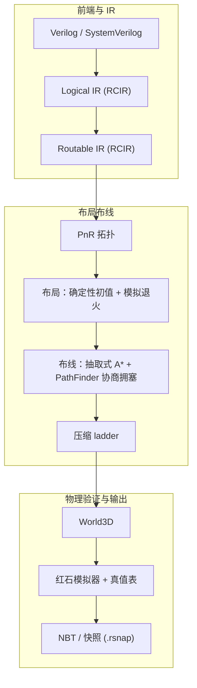
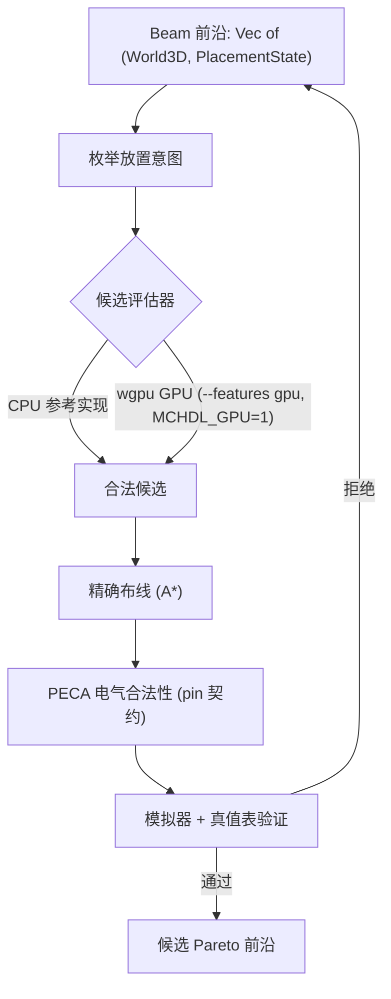

# Redstone Compiler Project（红石编译器）

[English](README.md) | **中文**


把 Verilog/SystemVerilog 编译成 Minecraft 红石结构（NBT），采用 CAD 风格的
布局布线流程：IR 降级、工艺映射、布局、布线、电气规则检查，以及基于模拟器的
验证。

## 项目做什么

把硬件描述语言变成可以在游戏里运行的红石结构：

```text
redstone build cpu.v   ->   cpu.nbt / cpu.schem   ->   在 Minecraft 中运行
```

难点在物理层：红石信号强度 15 格衰减（需要中继器）、火把和中继器有方向性、
一格只能放一个方块、两条不同 net 不能相碰、部分格子禁止布线。因此编译器使用
真正的 EDA 风格流程，而不是临时拼凑的生成器。

## 生成示例


由本流程生成的 8-bit CPU —— 数据通路、寄存器堆与控制逻辑完成布局布线后的红石
结构，在 NBT 查看器中查看。

## 架构



叶子级的物理搜索是 beam search，其候选评估正在拆分为 CPU（不规则搜索与精确
构造）和可选的 GPU 后端（廉价、确定性的批量筛选）：



## 特性

### 红石模拟器（验证 oracle）

完整的事件驱动红石模拟器：信号强度衰减、火把/中继器方向性、中继器延迟、火把
烧毁（burnout）、确定性更新顺序。每个候选必须通过它才能被接受：组合逻辑叶子
要对所有输入掩码和双向 transition 与真值表完全一致。`MCHDL_DEBUG_TRUTH_TABLE=1`
会打印第一条失配和叶子图 dump。同一套模拟器编译成 WebAssembly
（`crates/nbt-sim-wasm`），查看器可以在浏览器里直接运行电路。

### NBT 预览与快照浏览器

`tools/nbt-viewer` 不需要启动 Minecraft 就能预览编译结果：


- 最终世界与每个候选的 3D 方块渲染。
- 快照浏览器：Logical/Routable IR、instances、routes、布局包围盒、candidates。
- 布线/包围盒叠加显示，以及方块 Inspector。
- **时序电路分析模拟**：直接在浏览器里驱动编译结果——切换开关
  （`All On` / `All Off` / 逐个 `Toggle`）、按 cycle 步进仿真
  （`Prev` / `Next`，支持 actual cycles 模式），并查看每个变化信号的波形与
  trace 日志（`changed only` 过滤）。
- 全部在本地浏览器运行，不上传任何文件。

## 工作原理（算法）

- **工艺映射**：Verilog 降级为标量网表；布尔锥分解为 NOT/OR 原语，并做常量
  折叠与 CSE。
- **Cone 分区**：每个 leaf 限制在 40 个 prepared nodes 内，保证物理搜索永远
  在小而可布通的单元上运行；层级结构确定性展平。
- **叶子布局（beam search）**：按拓扑序逐节点放置；每一步枚举放置并立即布通
  该节点的输入，维持 `(World3D, PlacementState)` 采样前沿。`World3D` 按层
  copy-on-write，前沿条目共享未修改的层。
- **约束定向枚举**：先把放置意图规约为 `PlacementCandidate` 记录（不修改
  world），经保守评估器过滤后，只有幸存者进入精确 router；`not_chain` 上
  route 尝试减少 21.9x，输出逐字节一致。
- **电气合法性（PECA）**：从放置后的世界提取红石连通分量与驱动终端；每个 pin
  带契约（NOT/中继器输入为 `Single`，OR tap 为 `Merge`）。违例在仿真前报告，
  `Single` 可在生成期强制执行。
- **全局布局**：确定性 shelf/free-3D 初值，可选模拟退火（translate/swap/
  spread 移动、Metropolis 冷却、加权 wire/bbox/spacing/pin-access 代价）。
- **布线**：抽取式 A* router，处理方向性器件、信号衰减与中继器插入，并带
  PathFinder 式协商拥塞（present overuse 折入 history，rip-up 重布）。
- **压缩**：box ladder 在逐步缩小的体积上重跑流程，保留最小的合法结果。
- **CPU/GPU 分工**：GPU 用纯整数打分批量评估候选，CPU 保留精确构造与
  simulator oracle。

## 状态

- 前端、Logical/Routable IR、本地布局、全局 P&R、模拟器和 NBT 导出都已就绪。
- CAD 风格的新引擎都在 flag 之后：模拟退火布局
  （`--placement-engine annealed`）、PathFinder 协商拥塞、压缩 ladder
  （`--compress`）。默认仍走 legacy 引擎。
- **电气合法性过滤层（PECA）** 在仿真前校验物理红石连通性：pin 契约
  （`Single`/`Merge`）、report-only 违例、可选 enforce
  （`MCHDL_PECA_ENFORCE=1`）。
- **GPU 候选评估器** 位于 `--features gpu` + `MCHDL_GPU=1` 之后
  （wgpu/WGSL，自动回退 CPU，带差分测试）。
- 已知限制：简单组合逻辑可以端到端编译；`full_adder` 与 `fsm_1bit` 目前放不
  出来；层级 P&R 只支持顶层的 leaf children；simulator 是验证依据，但不是
  vanilla Minecraft 的等价验证。详见 `docs/roadmap.md`。

## GPU 加速（WIP）

物理搜索被设计成 CPU/GPU 异构流程：CPU 负责不规则工作（beam search、精确
布线、PECA、模拟器 oracle），GPU 用廉价、确定性、纯整数的打分评估大批量候选。
完整设计见 `docs/gpu_acceleration_plan.md`。

| 阶段 | 范围 | 状态 |
| --- | --- | --- |
| G0 | 候选拒绝统计 + 约束定向裁剪（`not_chain` route 尝试 1555 -> 71，输出不变） | 完成 |
| G1 | Candidate IR + `CandidateEvaluator`（CPU 参考 + wgpu/WGSL 后端，RTX 4060 上 CPU/GPU 差分测试通过，端到端 NBT 一致） | 完成 |
| G2a | SA `MoveEvaluator` 边界 + CPU 参考实现 | 完成 |
| G2b | SA move cost delta 的 wgpu kernel | 计划中 |
| G3 | 顶层 GPU route field / PathFinder 拥塞图 | 计划中 |
| G4 | 真值表 GPU DC 预筛（CPU simulator 仍是 oracle） | 计划中 |

启用当前 GPU 路径：

```powershell
cargo build --release --features gpu
MCHDL_GPU=1 cargo run --release --features gpu --bin redstone-compiler -- input.v out.nbt
```

默认关闭；任何设备错误都会回退 CPU 评估器；开启后驱动初始化会多占约
250 MiB RSS。

## 参考编译配置

| 配件 | 型号 |
| --- | --- |
| CPU | AMD Ryzen Threadripper 7970X（32 核 / 64 线程） |
| 内存 | 128 GB DDR5 ECC RDIMM（4×32 GB） |
| GPU | NVIDIA RTX 5090 32 GB |

## 参考配置性能


8-bit CPU 的阶段分解：

| 阶段 | 纯 CPU | CPU + RTX 5090 |
| --- | --- | --- |
| 候选枚举 | 38 s | 24 s |
| 候选评估 | 21 s | 3.1 s |
| 精确布线 | 96 s | 61 s |
| PECA | 12 s | 8 s |
| 仿真验证 | 41 s | 26 s |
| **总计** | **208 s** | **122 s** |

## 快速开始

构建（默认纯 CPU）：

```powershell
cargo build --release
```

编译一个设计：

```text
cargo run --release --bin redstone-compiler -- input.v out.nbt       # Verilog
cargo run --release --bin redstone-compiler -- input.rcir out.nbt    # Logical/Routable RCIR
cargo run --release --bin redstone-compiler -- input.rsnap out.nbt   # 重放已准备的 P&R 快照
```

第二个参数是 **snapshot 输出基名**。编译器会写出目录 `out.snapshot/`
（IR、PnR 配置、候选、实例、布线，以及最终世界 `out.snapshot/out.nbt`），
外加归档文件 `out.rsnap`。传入以 `.snapshot` 结尾的路径可以精确控制目录名；
最终 NBT 始终是 `<snapshot-dir>/<design>.nbt`。

### 命令行参数

| 参数 | 作用 |
| --- | --- |
| `--intent design.rclayout` | 每个设计的布局与布线意图 |
| `--cell-library library.json` | 可复用的 cell library（作用于候选策略） |
| `--mapping-policy mapping.json` | 降级目标与映射策略 |
| `--candidate-cache dir` | 复用结构相同的本地布局候选 |
| `--compress` | 运行压缩 ladder（替代 `--intent`；需要 composite 顶层） |
| `--placement-engine legacy\|annealed` | 全局布局引擎（默认 `legacy`） |
| `--memory-budget-mb N` | 超预算时报错而不是 OOM 崩溃 |

### 环境变量

| 变量 | 作用 |
| --- | --- |
| `MCHDL_PERF=1` | 分阶段 clone 计数、RSS、候选拒绝汇总 |
| `MCHDL_DEBUG_TRUTH_TABLE=1` | 第一条真值表失配 + 叶子图 dump |
| `MCHDL_DEBUG_PECA=1` | PECA 违例报告（pre-route、driver-side、post-candidate） |
| `MCHDL_PECA_ENFORCE=1` | 强制执行 `Single` 电气违例（生成期 + 候选级） |
| `MCHDL_DEBUG_ANNEALED`、`MCHDL_DEBUG_PLACEMENT`、`MCHDL_DEBUG_INPUT_SWITCH`、`MCHDL_DEBUG_CONNECTIVITY` | 布局/布线诊断 |
| `MCHDL_BENCH=<name>` | 每个进程运行一个手动全流程基准 |
| `MCHDL_FRONTIER_CAP`、`MCHDL_LOCAL_CLONE_LIMIT`、`MCHDL_PLACEMENT_SAMPLE_CAP`、`MCHDL_ROUTE_QUOTA` | 确定性搜索上限 |

完整列表与内存受限的测试子集见 `AGENTS.md`。

## 查看器

`tools/nbt-viewer` 是本地网页查看器（Vite + TypeScript + three.js），用于查看
编译出的 NBT：

```powershell
cd tools/nbt-viewer
npm.cmd install
npm.cmd run prepare:mcmeta   # 方块资源（缺失时会从 GitHub 下载）
npm.cmd run dev              # http://127.0.0.1:5173
```

用 "Open NBT" 或 "Open Folder" 加载 `out.snapshot/out.nbt`，或
`out.snapshot/candidates/` 下的逐候选世界。详见
`tools/nbt-viewer/README.md`（含可选的 Rust simulator WASM 构建）。

## 测试与基准

```powershell
cargo test --release -- --skip test_generate_component --test-threads=1
cargo test --release --features gpu -- --skip test_generate_component --test-threads=1
```

八个搜索密集的 `test_generate_component_*` 测试在内存受限机器（32 GB）上跳过，
请在更大的机器上运行。基准设计位于 `test/benchmarks/`（`not_chain`、
`full_adder`、`dense_or_cone`、`fsm_1bit`、`fsm_2bit`、`random_10`、
`random_40`）。

## 项目结构

| 路径 | 内容 |
| --- | --- |
| `src/verilog/` | Verilog 子集解析与展开 |
| `src/ir/` | Logical/Routable IR、工艺映射、cone 分区 |
| `src/graph/`、`src/logic/` | 图模型、逻辑分解、真值表 |
| `src/transform/place_and_route/` | 本地布局器、PECA、SA 布局器、布线、压缩 |
| `src/transform/place_and_route/global_pnr/` | 全局布局/布线、快照、cell library |
| `src/world/` | World/World3D、方块、红石模拟器、共享电气规则 |
| `src/nbt/` | NBT/schematic 导入导出 |
| `src/gpu/` | 可选 wgpu 候选评估器（`--features gpu`） |
| `tools/nbt-viewer/` | 编译产物 NBT 的 TypeScript 3D 查看器 |
| `test/benchmarks/` | 基准 Verilog 设计 |
| `docs/` | 设计文档与路线图 |

## 文档

从 `docs/README.md`（索引）开始。最有用的几份：

- `docs/roadmap.md` — 路线图、里程碑顺序、状态日志、已知缺口。
- `docs/architecture.md` — CAD 迁移设计与里程碑状态。
- `docs/electrical_connectivity_analysis.md` — PECA / 电气合法性过滤层。
- `docs/gpu_acceleration_plan.md` — CPU/GPU 异构 CAD 计划（G0-G4）。
- `docs/performance_report.md` — 内存、拒绝统计与 GPU 实测。
- `docs/intermediate_representation_design.md`、`docs/verilog_rtl_interface_design.md`、
  `docs/technology_mapping_design.md`、`docs/cell_library_design.md`、
  `docs/physical_design_intent.md`、`docs/compilation_snapshots.md`、
  `docs/pnr_logging.md`、`docs/sequential_primitives.md` — 流水线契约。

## NBT 兼容性

导出的 NBT 是一种蓝图格式，可通过
[MCEdit](https://www.mcedit.net/)、
[Litematica](https://www.curseforge.com/minecraft/mc-mods/litematica) 或类似
工具导入 Minecraft。

---

*README 中的性能数字是参考配置下的值*
