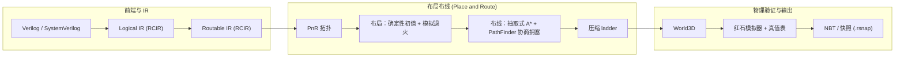
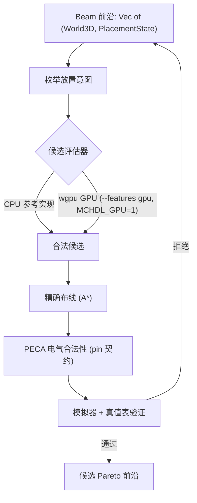

# Redstone Compiler Project（红石编译器）

[English](README.md) | **中文**

把 Verilog/SystemVerilog 编译成 Minecraft 红石结构（NBT），采用 CAD 风格的
布局布线流程：IR 降级、工艺映射、布局、布线、电气规则检查，以及基于模拟器的
验证。

## 项目做什么

把硬件描述语言变成可以在游戏里运行的红石结构：

```text
redstone build cpu.v   ->   cpu.nbt / cpu.schem   ->   在 Minecraft 中运行
```

难点在物理层：红石信号强度 15 格衰减（需要中继器）、火把和中继器有方向性、
一格只能放一个方块、两条不同 net 不能相碰、部分格子禁止布线。因此编译器使用
真正的 EDA 风格流程，而不是临时拼凑的生成器。

## 架构



叶子级的物理搜索是 beam search，其候选评估正在拆分为 CPU（不规则搜索与精确
构造）和可选的 GPU 后端（廉价、确定性的批量筛选）：



## 状态

- 前端、Logical/Routable IR、本地布局、全局 P&R、模拟器和 NBT 导出都已就绪。
- CAD 风格的新引擎都在 flag 之后：模拟退火布局
  （`--placement-engine annealed`）、PathFinder 协商拥塞、压缩 ladder
  （`--compress`）。默认仍走 legacy 引擎。
- **电气合法性过滤层（PECA）** 在仿真前校验物理红石连通性：pin 契约
  （`Single`/`Merge`）、report-only 违例、可选 enforce
  （`MCHDL_PECA_ENFORCE=1`）。
- **GPU 候选评估器** 位于 `--features gpu` + `MCHDL_GPU=1` 之后
  （wgpu/WGSL，自动回退 CPU，带差分测试）。
- 已知限制：简单组合逻辑可以端到端编译；`full_adder` 与 `fsm_1bit` 目前放不
  出来；层级 P&R 只支持顶层的 leaf children；simulator 是验证依据，但不是
  vanilla Minecraft 的等价验证。详见 `docs/roadmap.md`。

## 快速开始

构建（默认纯 CPU）：

```powershell
cargo build --release
```

编译一个设计：

```text
cargo run --release --bin redstone-compiler -- input.v out.nbt       # Verilog
cargo run --release --bin redstone-compiler -- input.rcir out.nbt    # Logical/Routable RCIR
cargo run --release --bin redstone-compiler -- input.rsnap out.nbt   # 重放已准备的 P&R 快照
```

第二个参数是 **snapshot 输出基名**。编译器会写出目录 `out.snapshot/`
（IR、PnR 配置、候选、实例、布线，以及最终世界 `out.snapshot/out.nbt`），
外加归档文件 `out.rsnap`。传入以 `.snapshot` 结尾的路径可以精确控制目录名；
最终 NBT 始终是 `<snapshot-dir>/<design>.nbt`。

### 命令行参数

| 参数 | 作用 |
| --- | --- |
| `--intent design.rclayout` | 每个设计的布局与布线意图 |
| `--cell-library library.json` | 可复用的 cell library（作用于候选策略） |
| `--mapping-policy mapping.json` | 降级目标与映射策略 |
| `--candidate-cache dir` | 复用结构相同的本地布局候选 |
| `--compress` | 运行压缩 ladder（替代 `--intent`；需要 composite 顶层） |
| `--placement-engine legacy\|annealed` | 全局布局引擎（默认 `legacy`） |
| `--memory-budget-mb N` | 超预算时报错而不是 OOM 崩溃 |

### 环境变量

| 变量 | 作用 |
| --- | --- |
| `MCHDL_PERF=1` | 分阶段 clone 计数、RSS、候选拒绝汇总 |
| `MCHDL_DEBUG_TRUTH_TABLE=1` | 第一条真值表失配 + 叶子图 dump |
| `MCHDL_DEBUG_PECA=1` | PECA 违例报告（pre-route、driver-side、post-candidate） |
| `MCHDL_PECA_ENFORCE=1` | 强制执行 `Single` 电气违例（生成期 + 候选级） |
| `MCHDL_DEBUG_ANNEALED`、`MCHDL_DEBUG_PLACEMENT`、`MCHDL_DEBUG_INPUT_SWITCH`、`MCHDL_DEBUG_CONNECTIVITY` | 布局/布线诊断 |
| `MCHDL_BENCH=<name>` | 每个进程运行一个手动全流程基准 |
| `MCHDL_FRONTIER_CAP`、`MCHDL_LOCAL_CLONE_LIMIT`、`MCHDL_PLACEMENT_SAMPLE_CAP`、`MCHDL_ROUTE_QUOTA` | 确定性搜索上限 |

完整列表与内存受限的测试子集见 `AGENTS.md`。

## 查看器

`tools/nbt-viewer` 是本地网页查看器（Vite + TypeScript + three.js），用于查看
编译出的 NBT：

```powershell
cd tools/nbt-viewer
npm.cmd install
npm.cmd run prepare:mcmeta   # 方块资源（缺失时会从 GitHub 下载）
npm.cmd run dev              # http://127.0.0.1:5173
```

用 "Open NBT" 或 "Open Folder" 加载 `out.snapshot/out.nbt`，或
`out.snapshot/candidates/` 下的逐候选世界。详见
`tools/nbt-viewer/README.md`（含可选的 Rust simulator WASM 构建）。

## 测试与基准

```powershell
cargo test --release -- --skip test_generate_component --test-threads=1
cargo test --release --features gpu -- --skip test_generate_component --test-threads=1
```

八个搜索密集的 `test_generate_component_*` 测试在内存受限机器（32 GB）上跳过，
请在更大的机器上运行。基准设计位于 `test/benchmarks/`（`not_chain`、
`full_adder`、`dense_or_cone`、`fsm_1bit`、`fsm_2bit`、`random_10`、
`random_40`）。

## 项目结构

| 路径 | 内容 |
| --- | --- |
| `src/verilog/` | Verilog 子集解析与展开 |
| `src/ir/` | Logical/Routable IR、工艺映射、cone 分区 |
| `src/graph/`、`src/logic/` | 图模型、逻辑分解、真值表 |
| `src/transform/place_and_route/` | 本地布局器、PECA、SA 布局器、布线、压缩 |
| `src/transform/place_and_route/global_pnr/` | 全局布局/布线、快照、cell library |
| `src/world/` | World/World3D、方块、红石模拟器、共享电气规则 |
| `src/nbt/` | NBT/schematic 导入导出 |
| `src/gpu/` | 可选 wgpu 候选评估器（`--features gpu`） |
| `tools/nbt-viewer/` | 编译产物 NBT 的 TypeScript 3D 查看器 |
| `test/benchmarks/` | 基准 Verilog 设计 |
| `docs/` | 设计文档与路线图 |

## 文档

从 `docs/README.md`（索引）开始。最有用的几份：

- `docs/roadmap.md` — 路线图、里程碑顺序、状态日志、已知缺口。
- `docs/architecture.md` — CAD 迁移设计与里程碑状态。
- `docs/electrical_connectivity_analysis.md` — PECA / 电气合法性过滤层。
- `docs/gpu_acceleration_plan.md` — CPU/GPU 异构 CAD 计划（G0-G4）。
- `docs/performance_report.md` — 内存、拒绝统计与 GPU 实测。
- `docs/intermediate_representation_design.md`、`docs/verilog_rtl_interface_design.md`、
  `docs/technology_mapping_design.md`、`docs/cell_library_design.md`、
  `docs/physical_design_intent.md`、`docs/compilation_snapshots.md`、
  `docs/pnr_logging.md`、`docs/sequential_primitives.md` — 流水线契约。

## NBT 兼容性

导出的 NBT 是一种蓝图格式，可通过
[MCEdit](https://www.mcedit.net/)、
[Litematica](https://www.curseforge.com/minecraft/mc-mods/litematica) 或类似
工具导入 Minecraft。
